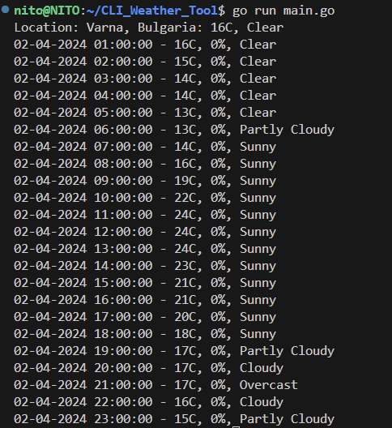
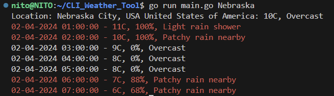

# CLI_Weather_Tool

This is a simple command-line interface (CLI) application that fetches weather forecast data from the WeatherAPI.
The output shows the weather for the day up till the end of it.

# Prerequisites
Go programming language (version 1.16 or later)
An API key from WeatherAPI

# Installation
Clone the repository: `git clone https://github.com/yourusername/weather-cli.git`

Build the application: `go build -o <name of the build>`

# Usage
Before you can use the application, you need to set up your WeatherAPI key. Create a .env file in the project root and add your API key:
`echo "WEATHER_API_KEY=your_api_key" > .env`

Replace your_api_key with your actual WeatherAPI key from here - https://www.weatherapi.com/ 

You can now run the application: ./<name of the build>

By default, the application will show the weather forecast for Varna, Bulgaria. You can specify a different location as a command-line argument:
./<name of the build> London

# Add to PATH
To use the weather command from any location on your system, you need to add it to your PATH.

## Linux/MacOS
Move the weather binary to /usr/local/bin.

